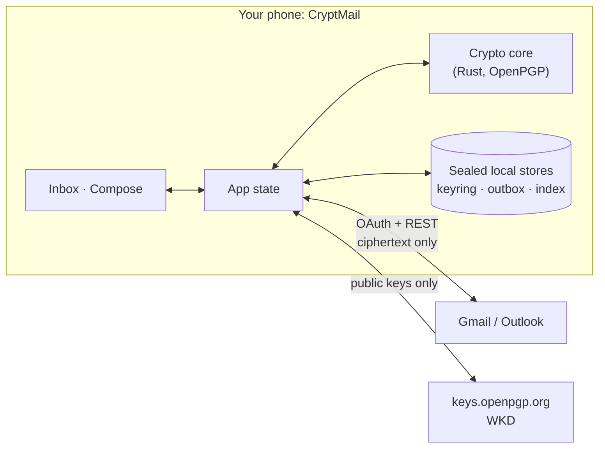

# CryptMail

**End-to-end encrypted email, in the mailbox you already have.**

Sign in with Gmail, Outlook, or any IMAP mailbox. Mail you send through CryptMail is encrypted on
your phone and decrypted only on the recipient's. It is still an ordinary email
in an ordinary inbox, so Gmail and Outlook show a block of ciphertext while
CryptMail shows the message.

```
You (CryptMail)  ──encrypt──▶  [ciphertext email]  ──▶  Recipient's Gmail inbox
                                        │
                    Gmail web UI shows: "-----BEGIN PGP MESSAGE----- ..."
                    CryptMail shows:   "Hey, are we still on for lunch?"
```

> **Working title, working prototype.** Not ready for real correspondence yet.
> See [Status](#status).

**Contents:** [How it works](#how-it-works) · [Guarantees](#guarantees) ·
[Status](#status) · [Quick start](#quick-start) · [Repo layout](#repo-layout) ·
[Documentation](#documentation) · [Contributing](#contributing)

---

## How it works

CryptMail is a **client, not a mail provider**, and there is **no CryptMail
server**. It talks to your mail provider and to public key infrastructure that
already exists.



1. **Keys.** Your keypair is generated on the device. Your public key is
   published to `keys.openpgp.org`. Recipients' keys come from there, from WKD,
   or from the `Autocrypt` header on mail they sent you.
2. **Send.** The message, including its real subject and attachment names, is
   encrypted to every recipient and to you, signed, and wrapped as PGP/MIME. The
   visible subject becomes `[Encrypted message]`. It is sent through the
   provider's API like any other email.
3. **Receive.** CryptMail fetches the ciphertext, decrypts it on the device,
   checks the signature against your keyring and shows how far that sender is
   trusted.

The wire format is specified in [docs/message-format.md](docs/message-format.md).
One message is traced end to end in
[docs/encryption-flow.md](docs/encryption-flow.md).

## Guarantees

- **No plaintext downgrade, ever.** If a recipient has no key yet, the message
  waits in your outbox, and they get a short invite that reveals nothing about
  it. It sends itself once they publish a key. If a recipient's key has
  **changed**, the send is blocked outright, because that could be a key
  substitution. The app says *queued*, never *sent*.
- **Your private key never leaves the device unencrypted.** Nothing crosses the
  crypto core's boundary but strings, and a private key is never returned from
  it. Key recovery uses a backup you keep, protected by a recovery code.
- **Local data is sealed.** Every store is encrypted under a device key held in
  the OS keystore. Opened encrypted mail is cached *as ciphertext*. The only
  decrypted mail on disk is a bounded search index, and you can clear it.
- **Stand-ins are never presented as secure.** Without the native core, the app
  runs a demo core that base64-encodes and **does not encrypt**, and every screen
  says so.
- **Post-quantum hybrid encryption.** The Rust core uses ML-KEM-768 + X25519
  (RFC 9980), so ciphertext harvested today resists a future quantum computer.
  Signatures are still classical Ed25519; see
  [docs/post-quantum.md](docs/post-quantum.md).
- **A security level per message.** `L1 · PGP` (standard OpenPGP, the
  default) and `L2 · Quantum` (AES-256-GCM keyed from a
  bank shared with the recipient over BB84, whose messages are themselves sealed
  to ML-KEM-768 + X25519 and signed). The Key Manager is **simulated**: its
  keys are random, not quantum. Level 3 (one-time pad) was removed.
  See [docs/security-levels-explained.md](docs/security-levels-explained.md).

**What it does not hide:** metadata. The sender, recipients, timestamps and
message size stay visible to your provider, because email cannot be delivered
without them. The full threat model is in [docs/security.md](docs/security.md).

## Status

A **prototype**: an Expo / React Native / TypeScript app in [app/](app/) and a
Rust crypto core in [core/](core/). Android is the target, and the web build is
for UI work only.

| | State |
|---|---|
| Rust crypto core, post-quantum round trip | ✅ Verified on an Android emulator |
| Interop with Sequoia-PGP | ✅ Verified both directions |
| Real Gmail: read, send, sign-in with several mailboxes | ✅ Run against a real account |
| Real Outlook (Microsoft Graph) | ✅ Run against a real mailbox · 🟨 encrypted mail over Graph unproven |
| Any other mailbox (IMAP/SMTP) | 🟨 Built and tested against in-memory servers · never run against a real one |
| Key recovery, safety-number verification, sealed local storage | ✅ Built and tested |
| Background delivery of queued mail | 🟨 Built on `expo-background-task` · never run on a device |
| Security levels 1–2 between two installs | ✅ Emulator + phone over Gmail (before the 2026-09-23 sender binding) · Level 3 removed |
| BB84 link messages sealed to ML-KEM + signed | 🟨 Built and tested · not yet run between two installs |
| Physical phone (StrongBox) | ⛔ Emulator only so far |

✅ means someone ran it and read the output. The deliberately pessimistic ledger
is [docs/implementation-status.md](docs/implementation-status.md).

### What the app already does

| Area | Built |
|---|---|
| **Mail** | Several mailboxes with an optional merged inbox · threading · search over decrypted mail · Sent, Archive, Trash, Spam, Snoozed · local labels and rules · multi-select · configurable swipe actions |
| **Writing** | Rich-text compose · attachments · reply, reply-all, forward · drafts with autosave · scheduled send · per-mailbox signatures · canned replies |
| **Keys and trust** | Key discovery and publishing (VKS, WKD, Autocrypt) · contacts with per-contact trust · safety numbers · key-change blocking · key recovery |
| **Safety** | On-device spam and phishing detection for plaintext mail · `http(s)`-only links, confirmed before opening · remote images can be blocked per mailbox |
| **Your data** | Export a mailbox as `.mbox` or `.eml` (encrypted mail stays sealed) · per-mailbox storage use · clear decrypted content |

What's next, and what each item is blocked on, is in
[docs/features.md](docs/features.md).

## Quick start

Requires Node 22+. There is no root `package.json`, so run every npm command
from `app/`.

```bash
cd app
npm install
npm run web            # quickest look at the UI
npm test               # jest-expo, 1571 tests
npx tsc --noEmit       # typecheck
```

CI runs exactly `npx tsc --noEmit` and `npm test -- --ci` from `app/`, and both
must pass.

Out of the box the app opens on the **connect screen with sign-in disabled**,
and it tells you why. There is deliberately no fake mailbox. To go further:

| To get | You need | Guide |
|---|---|---|
| Real Gmail | A Google Cloud OAuth **Web** client id in `app/.env` | [running-it.md §1](docs/running-it.md) |
| Real Outlook | An Azure app registration client id in `app/.env` | [running-it.md §1c](docs/running-it.md) |
| Any IMAP mailbox | A dev build (the socket is a native module), then an app-specific password | [running-it.md §1d](docs/running-it.md) |
| Real encryption | The Rust core built into an Android dev build (Expo Go cannot load it) | [running-it.md §2](docs/running-it.md) |

Use a throwaway mailbox for testing. Start from `app/.env.example`, and never
commit `app/.env`.

## Repo layout

```
app/        Expo SDK 57 / React Native 0.86 / TypeScript client
  src/
    screens/  UI; talks only to state/ through useApp()
    state/    the one layer that reaches everything below
    core/     CryptCore interface, demo core, native bridge, PGP/MIME
    mail/     MailClient: Gmail REST, Microsoft Graph, IMAP/SMTP
    auth/     Google (Play services), Microsoft (PKCE), IMAP (password in keystore)
    keys/     Autocrypt, keys.openpgp.org, WKD
    store/    sealed, per-account local stores
    ui/       primitives, theme-aware components
core/       Rust crypto core (UniFFI → Kotlin → turbo module)
docs/       design docs, the source of truth for behaviour
.github/    CI, PR and issue templates
```

Architecture in depth: [CLAUDE.md](CLAUDE.md) and
[docs/architecture.md](docs/architecture.md).

## Documentation

| Start here | |
|---|---|
| [overview.md](docs/overview.md) | Vision, goals, non-goals, user stories |
| [encryption.md](docs/encryption.md) | The cryptographic design |
| [encryption-flow.md](docs/encryption-flow.md) | One message end to end: keygen → exchange → send → receive |
| [implementation-status.md](docs/implementation-status.md) | What is verified, and every claim that isn't |
| [running-it.md](docs/running-it.md) | Turning on real mail and real encryption |

<details>
<summary><b>Design</b></summary>

| | |
|---|---|
| [architecture.md](docs/architecture.md) | Components, data flow, tech choices |
| [key-management.md](docs/key-management.md) | Keypairs, discovery, publishing, recovery |
| [message-format.md](docs/message-format.md) | Exactly what an encrypted email looks like on the wire |
| [data-model.md](docs/data-model.md) | Local stores and what each one holds |
| [providers.md](docs/providers.md) | Gmail API, Microsoft Graph, IMAP |
| [security.md](docs/security.md) | Threat model, guarantees, honest limitations |
| [post-quantum.md](docs/post-quantum.md) | RFC 9980 hybrid plan, with measured certificate sizes |
| [SPAM_PHISHING_DETECTION.md](docs/SPAM_PHISHING_DETECTION.md) | The on-device spam and phishing engine |
| [swipe-actions.md](docs/swipe-actions.md) | What each swipe does, and why |
| [api.md](docs/api.md) | A backend that is **not planned**, kept as a record of why |

</details>

<details>
<summary><b>Planning</b></summary>

| | |
|---|---|
| [features.md](docs/features.md) | Feature register: built, next, and what blocks each |
| [roadmap.md](docs/roadmap.md) | Phases and the candidate backlog |
| [prototype-plan.md](docs/prototype-plan.md) | Phase 0 milestones |
| [gmail-api-adoption.md](docs/gmail-api-adoption.md) | Gmail API features adopted and pending |
| [handoff.md](docs/handoff.md) | Dated snapshot after the first Android build |

</details>

<details>
<summary><b>UI</b></summary>

| | |
|---|---|
| [Design.md](Design.md) | Tokens, primitives, motion, traps. Read before any UI change. |
| [ui-rework.md](docs/design/ui-rework.md) | How the current look came about |

</details>

## Contributing

Read [CONTRIBUTING.md](CONTRIBUTING.md) before your first PR. Branch off `main`
as `feat/…`, `fix/…` or `docs/…`; every PR needs one review. Five rules are
enforced in review, and none of them is a style preference:

1. **No plaintext downgrade** on the encrypted send path.
2. **The demo core is not crypto.** Never hide that it is a demo.
3. **Only strings cross the core boundary**, and a private key is never returned
   from it.
4. **No secrets in the repo.** OAuth client ids live in `app/.env`.
5. **Screens go through `AppState`**, never straight to a provider or the core.

If a change contradicts a doc in [docs/](docs/), update the doc in the same PR.
Security problems in the crypto design or the send path go at the front of the
queue, so say so in the issue title.

---

<sub>There is no magic here. CryptMail generates an OpenPGP keypair on your
device, publishes the public half, and encrypts to recipients' public keys.
Only the matching private key, which never leaves the device unencrypted, can
read the result. Your provider stores and carries that ciphertext like any other
email, and if there is no key to encrypt to, nothing is sent in the clear.</sub>
